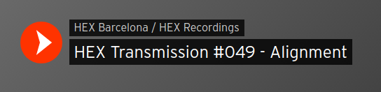
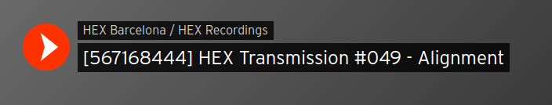

# Soundcloud Track IDer

For a project of mine I needed to easily find the Soundcloud Track ID. I wrote this Google Chrome Extension that prepends track titles with "[track_id]" for quick access.

### The player before injection:
;

### The player after injection:
;